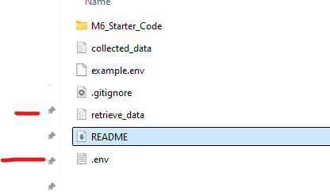

data-sourcing-challenge

##  The key skill acquired by doing this challenge is how to build code to call an API.

# Lessons Learned 
1. API Key in Text Document:  Always use a plain text editor to create your .env file.
2. Correct File Placement:  Ensure that your .env file is in the same directory as your Jupyter notebook and positioned below it in the folder
  
3. Accurate API Call URL:  Double-check the URL construction in your code.
4. Kernel Restart:  restart the kernel to ensure changes are picked up.